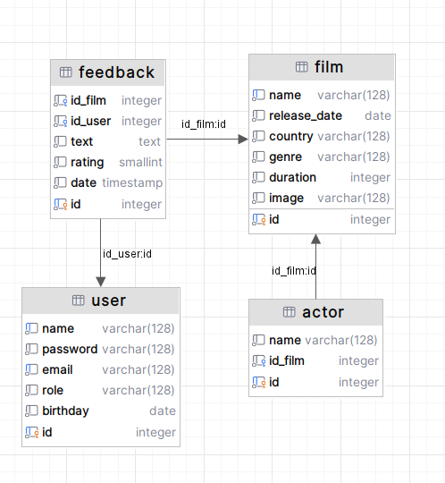

# Видеотека

## Обзор

**Веб-сервис**, реализующий упрощенный функционал видеотеки.

## Стек

`Java 17`, `Maven`, `Servlets`, `JDBC`, `PostgreSQL`,  `Lombok`,  `Junit5`, `Assertj`, `Mockito`

## Реализованый функционал

### Aдминистратор

- Вход в систему
- Добавление нового фильма в систему
- Удаление фильма из системы
- Редактирование информации о фильме
- Просмотр отзывов любого пользователя
- Удаление отзыва любого пользователя
- Скачивание отчета с отзывами любого пользователя
- Выход из системы

### Пользователь

- Вход в систему
- Просмотр список всех фильмов, возможность фильтрации по любому полю
- Добавление отзыва о фильме
- Возможность удаления оставленного отзыва
- Выход из системы

## Дополнительно

Реализована функция переключения языков в системе

## База данных

В качестве базы данных в приложении используется Postgres. ER-диаграмма изображена на рисунке:

## Связь

- **Email**: andrejantonov63@gmail.com
- **Telegram**: [a_antonov](https://t.me/andrej27022)
- **Вк:** [Андрей Антонов](https://vk.com/id210504883)